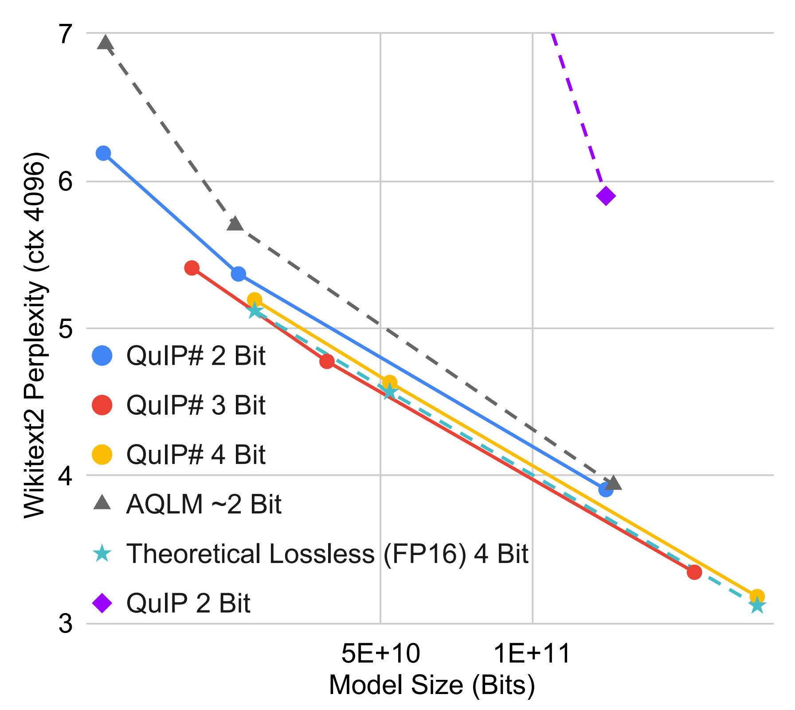

# [QuIP#: Even Better LLM Quantization with Hadamard Incoherence and Lattice Codebooks](https://arxiv.org/abs/2402.04396), ICML 2024

QuIP# is a weight-only post-training quantization method that achieves state-of-the-art performance in extreme compression ($\le 4$ bits per weight) regimes.
QuIP# introduces (1) faster and better [incoherence processing](https://openreview.net/pdf?id=xrk9g5vcXR) with the randomized Hadamard transform (RHT), (2) fast vector quantization with $E_8$ lattice-based codebooks, and (3) a fine-tuning scheme to capture inter-layer interactions.
This codebase contains code that allows users to quantize and deploy their own QuIP# models as well as CUDA kernels for fast inference.
Please open a GitHub ticket if you have any questions about the code or QuIP# in general.
Prequantized QuIP# models are available [here](https://huggingface.co/relaxml).

### QuIP# Scaling
QuIP# is the first PTQ method where 3 bit models scale better than theoretically lossless 4 bit models.



### QuIP# Inference Throughput
Timed on a RTX6000 ADA.
|    Method   |    2-7B    | 2-70B |
|:-----------:|:----------:|:-----:|
|     FP16    | 57.7 tok/s |  OOM  |
|  AQLM 2 Bit |    81.1    |  8.72 |
| QuIP# 2 Bit |    176   |  21.9 |


## Latest Updates

- Our latest method, [QTIP](https://github.com/Cornell-RelaxML/qtip), uses trellis quantization to achieve even higher quality quantized models.

## Installation

- Clone the repo
- Install the requirements via `pip install -r requirements.txt`.
- Build and install the CUDA inference kernels. (`cd quiptools && python setup.py install && cd ../`)
- Install the [fast-hadamard-transform](https://github.com/Dao-AILab/fast-hadamard-transform) package. This package is also available through pip but recently I've had issues installing it through pip.

## Quantization

Example quantization scripts for the Llama family of models are located in `quantize_llama`. Follow these scripts to use QuIP# on other architectures. Within `quantize_llama`:
- `hessian_offline_llama.py` contains code to generate model Hessians. **Hessian calculation uses a `fp64` accumulator for numerical accuracy. Running this script on a device with slow `fp64` capabilities will take longer -- you may want to change the accumulator to `fp32` if so.** The HF repo includes pregenerated Hessians for a variety of models.
    - `--batch_size` Batch size per GPU. Tune so you don't run out of memory.
    - `--devset_size` Size of devset to use for Hessian generation.
    - `--ctx_size` Context size (sequence length) to use for Hessian generation.
    - `--base_model` Full precision HF model.
- `quantize_finetune_llama.py` contains code to quantize llama with fine-tuning ("fine-tuning during quantization" in the paper).
    - To reproduce earlier QuIP# results without fine-tuning, pass `--ft_epochs 0`
    - `--save_path` Output path.
    - `--base_model` Full precision HF model. Llama 1 weights are available at `relaxml/Llama-1-<7,13,30,65>b-hf`.
    - `--hessian_path` Offline Hessians. We provide precomputed Hessians at repo_id's `relaxml/Hessians*-<n>`. These Hessians were computed with `n` samples and the context length and attention mask used to train the original model. To download them, run `python scripts/download_hf.py --folder_path <local path to save Hessians> --repo_id <repo_id> --read_token <huggingface read token>`.
    - `--codebook` Codebook. Use `E8P12` for 2 bits, `E8P12RVQ3B` for 3 bits, and `E8P12RVQ4B` for 4 bits (RVQ stands for residual vector quantization).
    - `--scale_override` and `--resid_scale_override`. Post-incoherence processing scale overrides. We suggest using 0.9 for `E8P12` and the default scales for 3 and 4 bit models. You may want to manually tune these for your specific model.
    - `--ft*` Various fine tuning arguments. `--ft_grad_ckpt` turns on gradient checkpointing and `--ft_train_mode` manifests the full quantized matrix during fine-tuning. We recommend turning `--ft_train_mode` on if you have enough memory since it makes training go faster.
- `finetune_e2e_llama.py` tunes the sign vectors (SU/SV), layernorms, and language model head of a given model (the second fine-tuning step in the paper). The arguments are similar to `quantize_finetune_llama.py`. You will need to convert the output of that script to a Hf model with `hfize_llama.py` before running this script. The HF-ized model should be passed in through `--hf_path`.
- `hfize_llama.py` converts a quantized model to the HF format. 

### I want to quantize a non-Llama architecture model, what do I do?

The scripts in `quantize_llama` are written with the Llama architecture in mind.
However, QuIP# is adaptable to any architecture with linear layers. 
To use QuIP# on a new architecture, identify the relevant linear layers and update the scripts in `quantize_llama`.
Feel free to open a GitHub issue if you run into issues.
    
## Evaluation

`eval` contains evaluation scripts. These scripts may need `CUDA_VISIBLE_DEVICES=0` if you run into CUDA errors due to how HF accelerate works. 
- `eval_ppl.py` calculates perplexity on Wikitext2 and C4.
- `eval_zeroshot.py` calculates performance on zeroshot tasks.
- `eval_speed.py` times the forward pass for one token.

## Fast Inference and Text Generation
QuIP# was designed to support fast inference. Example inference kernels for recent NVIDIA GPUs can be found in the `quiptools` folder.
We are currently missing a 1 bit matrix-vector multiply kernel needed to make 3 bit inference fast, so if you'd like to contribute feel free to open a pull request.

`eval/interactive_gen.py` contains a very simple interactive generation script. 
This script is very rudimentary and you may want to write your own - all it does is call HF's `.generate()` function.
**HF generate does not currently work out-of-the-box with CUDA graphs. Thus, this script will be very slow since most of the time is spent on kernel launches.**
QuIP# should work with any codebase and people have reported success integrating it with vLLM, so we may switch away from HF in the future -- the purpose of this codebase is to provide a reference implementation for QuIP#.

**[Update] https://github.com/Cornell-RelaxML/quip-sharp/pull/65 adds CUDA graph support to HF, so this codebase will support fast inference soon!**

## Model Zoo
Example quantized models (mostly Llama 1 and 2) can be found on our [HF repo](https://huggingface.co/relaxml). 
To use them, pass the given HF repo_id to `--hf_path`.
The 3 bit models are currently significantly slower than the 2 and 4 bit models during generation since we have not written an optimized matvec CUDA kernel for them yet.
Feel free to open a pull request with a link to your own quantized QuIP# model if you want us to list it here. 

| Codebook | Base Model  | Weight Bits | HF repo_id |
|:----------------:|:-----------|:-----------:|:----------------|
| E8P 2 Bit        | Llama 2 70b | 2           | [`relaxml/Llama-2-70b-E8P-2Bit`](https://huggingface.co/relaxml/Llama-2-70b-E8P-2Bit) |
|                  | Llama 2 70b chat| 2       | [`relaxml/Llama-2-70b-chat-E8P-2Bit`](https://huggingface.co/relaxml/Llama-2-70b-chat-E8P-2Bit) |
|                  | Llama 2 13b | 2           | [`relaxml/Llama-2-13b-E8P-2Bit`](https://huggingface.co/relaxml/Llama-2-13b-E8P-2Bit) |
|                  | Llama 2 13b chat| 2       | [`relaxml/Llama-2-13b-chat-E8P-2Bit`](https://huggingface.co/relaxml/Llama-2-13b-chat-E8P-2Bit) |
|                  | Llama 2 7b  | 2           | [`relaxml/Llama-2-7b-E8P-2Bit`](https://huggingface.co/relaxml/Llama-2-7b-E8P-2Bit)   |
|                  | Llama 2 7b chat| 2        | [`relaxml/Llama-2-7b-chat-E8P-2Bit`](https://huggingface.co/relaxml/Llama-2-7b-chat-E8P-2Bit) |
|                  | Llama 1 65b | 2           | [`relaxml/Llama-1-65b-E8P-2Bit`](https://huggingface.co/relaxml/Llama-1-65b-E8P-2Bit) |
|                  | Llama 1 30b | 2           | [`relaxml/Llama-1-30b-E8P-2Bit`](https://huggingface.co/relaxml/Llama-1-30b-E8P-2Bit) |
|                  | Llama 1 13b | 2           | [`relaxml/Llama-1-13b-E8P-2Bit`](https://huggingface.co/relaxml/Llama-1-13b-E8P-2Bit) |
|                  | Llama 1 7b  | 2           | [`relaxml/Llama-1-7b-E8P-2Bit`](https://huggingface.co/relaxml/Llama-1-7b-E8P-2Bit)   |
|		   | Mistral 7b (non fine-tuned) | 2	       | [`relaxml/Mistral-7b-E8P-2Bit`](https://huggingface.co/relaxml/Mistral-7b-E8P-2Bit)   |
|		   | OpenHermes 2.5 (non fine-tuned) | 2	       | [`relaxml/Openhermes-7b-E8P-2Bit`](https://huggingface.co/relaxml/Openhermes-7b-E8P-2Bit)   |
| E8P RVQ 3 Bit    | Llama 2 70b | 3           | [`relaxml/Llama-2-70b-E8PRVQ-3Bit`](https://huggingface.co/relaxml/Llama-2-70b-E8PRVQ-3Bit) |
|                  | Llama 2 70b chat| 3       | [`relaxml/Llama-2-70b-chat-E8PRVQ-3Bit`](https://huggingface.co/relaxml/Llama-2-70b-chat-E8PRVQ-3Bit) |
|                  | Llama 2 13b | 3           | [`relaxml/Llama-2-13b-E8PRVQ-3Bit`](https://huggingface.co/relaxml/Llama-2-13b-E8PRVQ-3Bit) |
|                  | Llama 2 13b chat| 3       | [`relaxml/Llama-2-13b-chat-E8PRVQ-3Bit`](https://huggingface.co/relaxml/Llama-2-13b-chat-E8PRVQ-3Bit) |
|                  | Llama 2 7b  | 3           | [`relaxml/Llama-2-7b-E8PRVQ-3Bit`](https://huggingface.co/relaxml/Llama-2-7b-E8PRVQ-3Bit)   |
|                  | Llama 2 7b chat| 3        | [`relaxml/Llama-2-7b-chat-E8PRVQ-3Bit`](https://huggingface.co/relaxml/Llama-2-7b-chat-E8PRVQ-3Bit) |
|                  | Llama 1 65b | 3           | [`relaxml/Llama-1-65b-E8PRVQ-3Bit`](https://huggingface.co/relaxml/Llama-1-65b-E8PRVQ-3Bit) |
|                  | Llama 1 30b | 3           | [`relaxml/Llama-1-30b-E8PRVQ-3Bit`](https://huggingface.co/relaxml/Llama-1-30b-E8PRVQ-3Bit) |
|                  | Llama 1 13b | 3           | [`relaxml/Llama-1-13b-E8PRVQ-3Bit`](https://huggingface.co/relaxml/Llama-1-13b-E8PRVQ-3Bit) |
|                  | Llama 1 7b  | 3           | [`relaxml/Llama-1-7b-E8PRVQ-3Bit`](https://huggingface.co/relaxml/Llama-1-7b-E8PRVQ-3Bit)   |
|		   | Mistral 7b (non fine-tuned) | 3	       | [`relaxml/Mistral-7b-E8PRVQ-3Bit`](https://huggingface.co/relaxml/Mistral-7b-E8PRVQ-3Bit)   |
|		   | OpenHermes 2.5 (non fine-tuned) | 3	       | [`relaxml/Openhermes-7b-E8PRVQ-3Bit`](https://huggingface.co/relaxml/Openhermes-7b-E8PRVQ-3Bit)   |
| E8P RVQ 4 Bit    | Llama 2 70b | 4           | [`relaxml/Llama-2-70b-E8PRVQ-4Bit`](https://huggingface.co/relaxml/Llama-2-70b-E8PRVQ-4Bit) |
|                  | Llama 2 70b chat| 4       | [`relaxml/Llama-2-70b-chat-E8PRVQ-4Bit`](https://huggingface.co/relaxml/Llama-2-70b-chat-E8PRVQ-4Bit) |
|                  | Llama 2 13b | 4           | [`relaxml/Llama-2-13b-E8PRVQ-4Bit`](https://huggingface.co/relaxml/Llama-2-13b-E8PRVQ-4Bit) |
|                  | Llama 2 13b chat| 4       | [`relaxml/Llama-2-13b-chat-E8PRVQ-4Bit`](https://huggingface.co/relaxml/Llama-2-13b-chat-E8PRVQ-4Bit) |
|                  | Llama 2 7b  | 4           | [`relaxml/Llama-2-7b-E8PRVQ-4Bit`](https://huggingface.co/relaxml/Llama-2-7b-E8PRVQ-4Bit)   |
|                  | Llama 2 7b chat| 4        | [`relaxml/Llama-2-7b-chat-E8PRVQ-4Bit`](https://huggingface.co/relaxml/Llama-2-7b-chat-E8PRVQ-4Bit) |
|                  | Llama 1 65b | 4           | [`relaxml/Llama-1-65b-E8PRVQ-4Bit`](https://huggingface.co/relaxml/Llama-1-65b-E8PRVQ-4Bit) |
|                  | Llama 1 30b | 4           | [`relaxml/Llama-1-30b-E8PRVQ-4Bit`](https://huggingface.co/relaxml/Llama-1-30b-E8PRVQ-4Bit) |
|                  | Llama 1 13b | 4           | [`relaxml/Llama-1-13b-E8PRVQ-4Bit`](https://huggingface.co/relaxml/Llama-1-13b-E8PRVQ-4Bit) |
|                  | Llama 1 7b  | 4           | [`relaxml/Llama-1-7b-E8PRVQ-4Bit`](https://huggingface.co/relaxml/Llama-1-7b-E8PRVQ-4Bit)   |
|		   | Mistral 7b (non fine-tuned) | 4	       | [`relaxml/Mistral-7b-E8PRVQ-4Bit`](https://huggingface.co/relaxml/Mistral-7b-E8PRVQ-4Bit)   |
|		   | OpenHermes 2.5 (non fine-tuned) | 4	       | [`relaxml/Openhermes-7b-E8PRVQ-4Bit`](https://huggingface.co/relaxml/Openhermes-7b-E8PRVQ-4Bit)   |


## Other

### Third Party Implementations

https://github.com/chu-tianxiang/QuIP-for-all contains a third party implementation of QuIP#. We have not verified the correctness of the repo, but it seems to work properly and has out of the box integration with other frameworks (vLLM, gpt-fast, etc).

### Licensing

Use of Llama models is governed by the Meta license available [here](https://ai.meta.com/resources/models-and-libraries/llama-downloads/).
Use of Mistral models is governed by the Apache 2.0 license.
Use of this code is governed by the GNU GPL v3 license.

If you found this work useful, please consider citing
```
@inproceedings{
    tseng2024quip,
    title={Qu{IP}\${\textbackslash}\#\$: Even Better {LLM} Quantization with Hadamard Incoherence and Lattice Codebooks},
    author={Albert Tseng and Jerry Chee and Qingyao Sun and Volodymyr Kuleshov and Christopher De Sa},
    booktitle={Forty-first International Conference on Machine Learning},
    year={2024},
    url={https://openreview.net/forum?id=9BrydUVcoe}
}
```
